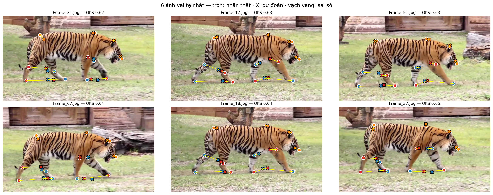
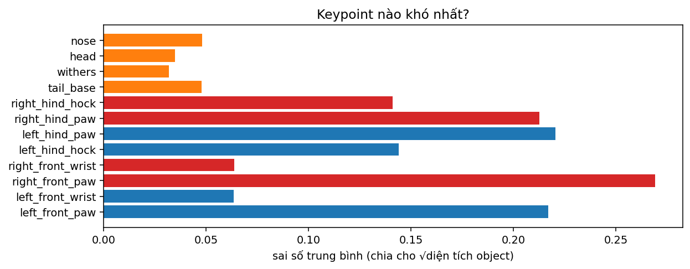

# Báo cáo Lab 18 — 2D Perception

Link notebook đã chạy: https://www.kaggle.com/code/dung3te/notebook2afba1458e

Môi trường: cuda, torch 2.11.0+cu128, ultralytics 8.4.171.

## Fine-tune tiger-pose

| flip_idx | epochs | imgsz | Box mAP50-95 | Pose mAP50 | Pose mAP50-95 | train (phút) |
|---|---|---|---|---|---|---|
| giải phẫu | 40 | 640 | 0.9123 | 0.9950 | 0.4776 | 5.4000 |

OKS trung bình: 0.7422; bỏ sót 0/53 ảnh; nghi đảo trái/phải 4/53 ảnh.

## Q1–Q12

### Q1

640×480 cho 80×60 + 40×30 + 20×15 = 6 300 vị trí dự đoán, ít hơn 8 400 vì một chiều lưới chỉ còn 3/4 so với ảnh 640×640.
Nếu box lệch sang phải và xuống dưới đúng nửa kích thước, nhãn gốc là cxcywh nhưng tâm đã bị đọc như góc trên-trái xywh.
Hình minh hoạ trong notebook làm chiều nhầm ngược lại: xywh bị đọc như cxcywh nên box đỏ lệch sang trái và lên trên; cần phân biệt hướng dịch trong đề với hình.

### Q2

Trong bảng lần chạy này, chênh lệch lớn nhất là postprocess (ms) tại conf=0.001: one-to-many 1.42 ms, one-to-one 0.44 ms, lệch 0.98 ms. Riêng postprocess ở conf 0.001 là 1.42 so với 0.44 ms; thời gian có thể dao động nên không ép mọi máy phải cho cùng thứ tự. Conf thấp hoặc cảnh đông giữ nhiều ứng viên khiến NMS phải xét nhiều giao nhau, còn one-to-one không cần bước loại duplicate này. Trên CPU/NPU, NMS còn có thể chạy ngoài bộ tăng tốc và tốn chuyển dữ liệu/đồng bộ, nên bỏ NMS thường giúp giảm phần xử lý đó.

### Q3

Hai công nhân cùng class có IoU 0.75 > 0.7 nên NMS sẽ loại box có confidence thấp hơn dù có thể là hai người thật.
Tăng ngưỡng giúp giữ hai người đứng sát nhau nhưng giữ thêm duplicate; giảm ngưỡng dọn duplicate mạnh hơn nhưng dễ đếm thiếu.
YOLO26 vẫn train head one-to-many vì nhiều phép gán positive cung cấp tín hiệu học dày cho backbone/neck và hỗ trợ hội tụ, trong khi head one-to-one học gán một dự đoán cho mỗi object để suy luận không NMS.

### Q4

Lần chạy này semantic có 8 vùng person, Mask R-CNN đếm 4 người, còn ảnh có 4 người. Hai người chạm nhau có thể bị nối thành một vùng gây đếm thiếu; một người bị che hoặc mask bị đứt thành nhiều mảnh gây đếm thừa. Panoptic thêm instance ID cho từng đối tượng thuộc nhóm things, kết hợp class cho stuff, nên đếm theo ID thay vì vùng liên thông. Trong box xe buýt, class chiếm nhiều pixel nhất là train (63.5%); model semantic học trên Cityscapes có thể nhầm hình dáng/kết cấu với train hoặc các phương tiện tương tự do khác biệt dữ liệu và góc nhìn.

### Q5

YOLO26-seg dựng mask từ 32 prototype dùng chung có độ phân giải hữu hạn, nên vật nhỏ/chi tiết mảnh chỉ chiếm ít ô prototype và dễ mất biên.
Mask R-CNN dùng lưới 28×28 trong mỗi RoI, nên object lớn có thể bị biên thô khi mask được phóng lớn về ảnh; chất lượng còn phụ thuộc feature và RoIAlign.
Hungarian matching tối đa tổng IoU dưới ràng buộc một-một, còn chọn IoU lớn nhất độc lập có thể ghép nhiều mask YOLO vào cùng một mask Mask R-CNN và bỏ sót instance khác.
IoU giữa hai model chỉ đo độ giống nhau của các dự đoán, không phải độ chính xác so với ground-truth.

### Q6

Điểm A cho gần toàn bộ instance trong box, 47441 pixel (IoU cao nhất với mask từ box 0.987); điểm B cho một bộ phận/vùng khác, không phủ toàn bộ instance, 2714 pixel (IoU 0.000), cho thấy một điểm trong box người vẫn có thể chọn bộ phận nhỏ; đối chiếu mask trên hình để xác định vùng cụ thể. Một điểm không xác định đầy đủ phạm vi instance, còn box bao quanh người cung cấp phạm vi rõ hơn nên thường an toàn hơn cho auto-label, dù box sai vẫn gây nhãn sai. Dùng SAM trực tiếp khi có prompt tương tác, cần tính linh hoạt và đủ tài nguyên; với camera nhiều ảnh liên tục, dùng SAM tạo nhãn rồi kiểm tra/sửa và train YOLO26-seg nhỏ để giảm latency.

### Q7

Khi KP_THR=-100, model vẫn trả tọa độ đầu gối/mắt cá, với y từ 700.2 đến 710.0 px trên ảnh cao 720 px; các chấm được vẽ tại vị trí dự đoán trong RoI dù chân thật nằm ngoài khung, thường tụ gần đáy vùng người. Argmax luôn chọn một cực đại heatmap, kể cả heatmap yếu hoặc điểm không quan sát được, nên có tọa độ không chứng minh điểm hiện diện và đúng. Cần confidence/logit và thông tin visibility để bỏ qua các điểm thiếu tin cậy trước khi suy ra góc hoặc hành động.

### Q8

Từ các đường Monte Carlo lần chạy này, OKS qua 0.5 ở độ lệch chuẩn nhiễu khoảng 7.0 px cho người 40×80 và 43.7 px cho người 250×500. Đây là σ của nhiễu Gauss theo mỗi trục, không phải mọi điểm đều bị dịch đúng số pixel đó. Mắt có sigma COCO nhỏ vì cần định vị chính xác và ít mơ hồ hơn hông; khi lệch 8 px, độ giống riêng mắt là 0.53 còn hông là 0.97. Với người chỉ cao khoảng 80 px trên camera trên cao, sai số vài pixel đã ảnh hưởng mạnh nên cần đủ độ phân giải, dữ liệu đúng góc nhìn và lọc điểm thiếu tin cậy.

### Q9

Luật thân nghiêng >60° có thể báo nhầm người cúi sâu, nằm nghỉ/chơi thể thao hoặc ảnh camera bị nghiêng; có thể bỏ sót ngã hướng về camera làm thân chiếu gần thẳng đứng, hoặc ngã khi vai/hông bị che. Nếu keypoint không đủ tin cậy thì trạng thái là chưa kết luận, không được xem như đứng an toàn. Lần chạy này ảnh gốc phát hiện 5 người, ảnh xoay phát hiện 3 người; model học nhiều người đứng thẳng nên ảnh quay 90° gây lệch phân bố và confidence giảm, dù số người thật không đổi. Để cảnh báo thực tế cần thêm chuỗi thời gian, vận tốc hông và tư thế sau ngã, cùng dữ liệu camera/ngã đa hướng.

### Q10

Thống kê lần chạy này: train 210 quay phải/0 quay trái, val 53 quay phải/0 quay trái. Giữ flip_idx đồng nhất có thể vẫn cho mAP cao trên val chỉ quay phải, vì tập đó không kiểm tra đúng lỗi hoán đổi nhãn ở hướng quay trái. Khi triển khai gặp hổ quay trái/ảnh lật gương, model có thể đảo keypoint trái-phải; cần val hai hướng và kiểm tra nhãn giải phẫu, không chỉ dựa vào mAP val gốc.

### Q11

Kiểu lỗi 1 là nghi đảo trái/phải ở Frame_31.jpg: OKS=0.621, sau hoán đổi nhãn chân tăng lên 0.668; cần đối chiếu dấu X đỏ/xanh với nhãn tròn trên hình, khắc phục bằng kiểm tra nhãn giải phẫu và bổ sung dữ liệu hai hướng với flip_idx đúng.
Kiểu lỗi 2 là định vị điểm trục giữa lệch nhãn: Ảnh Frame_31.jpg (OKS=0.621), điểm tail_base: GT=(315.0,159.0), dự đoán=(347.3,195.5) px, sai số chuẩn hoá 0.108; vạch vàng nối hai vị trí trên hình. Khắc phục bằng thống nhất hướng dẫn gán nhãn mũi/đầu/withers/gốc đuôi và thêm ví dụ có sai số lớn vào tập train.

### Q12

Dùng sigma=1/12 cho mọi keypoint là mặc định tiện để chấm dataset custom, nhưng giả định mũi và gốc đuôi có cùng độ mơ hồ nên không phản ánh đầy đủ độ khó gán nhãn của từng điểm.
Sigma lớn làm cùng sai số pixel được chấm nhẹ hơn, vì vậy mAP/OKS cao có thể che lỗi định vị và cần xem thêm sai số pixel/chuẩn hoá theo từng keypoint.
Để ước lượng sigma, cho nhiều người gán nhãn độc lập cùng một tập ảnh train/calibration đại diện, đo độ phân tán từng điểm sau khi chuẩn hoá theo kích thước object, xử lý visibility và ngoại lệ, rồi cố định sigma trước khi đánh giá.
Không ước lượng từ sai số model trên val hay điều chỉnh sigma để tăng điểm; giữ cùng bộ sigma khi so sánh các model.
